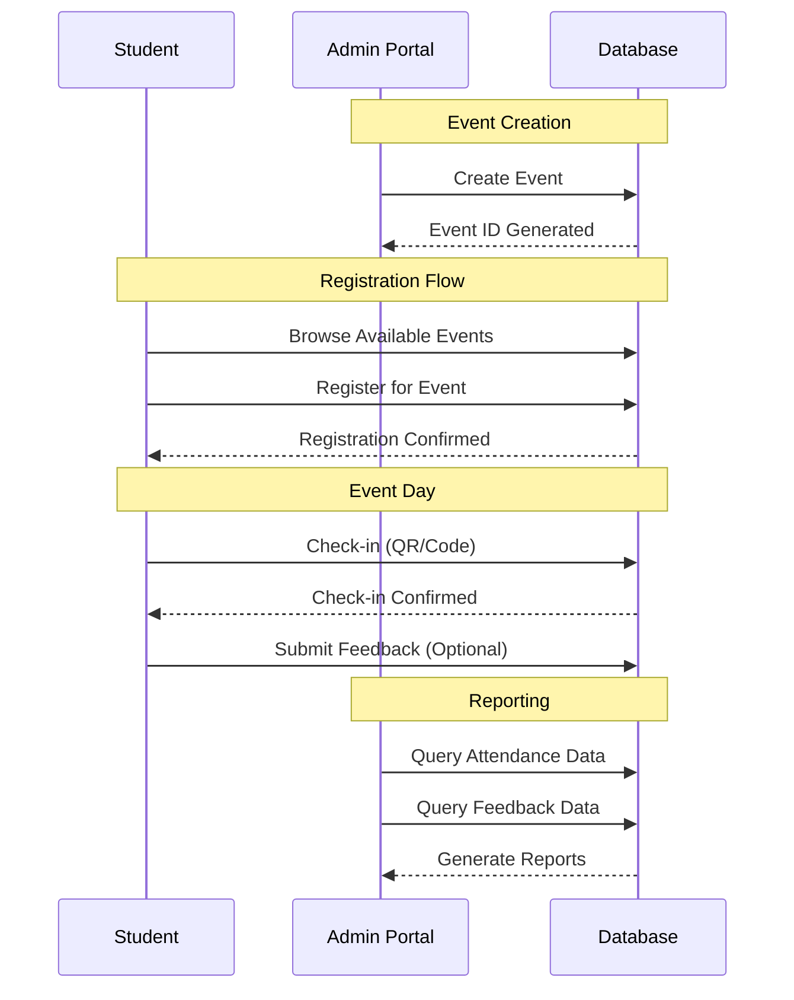

# Campus Event Management Platform - Design Document

## Step 1: Brainstorming & Key Assumptions

### Realistic Assumptions
- **Event IDs**: Scoped per college (simpler isolation, easier to manage)
- **User Base**: 50 colleges × 500 students = 25,000 total users
- **Event Load**: ~20 events per semester per college = 1,000 events/semester
- **Peak Usage**: Registration opens simultaneously, expect high concurrent load
- **Data Retention**: Keep historical data for academic reporting
- **Authentication**: Simple student ID + password (no complex SSO for MVP)
- **Mobile Check-in**: QR codes or simple event codes
- **Offline Capability**: Not required for MVP

### Key Decisions to Make
1. **Data Isolation Strategy**
   - Option A: Single database with college_id partitioning
   - Option B: Separate databases per college
   - Option C: Multi-tenant with shared schema
   
2. **Event ID Strategy**
   - Global unique IDs (complex but scalable)
   - College-scoped IDs (simple, e.g., "CS101-001")
   
3. **Registration Limits**
   - First-come-first-serve vs waitlists
   - Allow overbooking percentage?
   
4. **Attendance Tracking**
   - Grace period for late check-ins
   - Multiple check-in attempts handling

## Step 2: Design Document

### Data to Track

#### Core Entities
- **Event**: title, description, type, date_time, location, college_id, max_seats, status
- **Registration**: student_id, event_id, timestamp, status (confirmed/waitlisted/cancelled)
- **Attendance**: student_id, event_id, check_in_time, check_out_time (optional)
- **Feedback**: student_id, event_id, rating (1-5), comment, timestamp

#### Supporting Data
- **Student**: student_id, name, email, college_id, major, graduation_year
- **College**: college_id, name, location, admin_contact

### Database Schema

```sql
-- Colleges table (optional but recommended for multi-college support)
CREATE TABLE colleges (
    college_id VARCHAR(10) PRIMARY KEY,
    name VARCHAR(100) NOT NULL,
    location VARCHAR(100),
    admin_email VARCHAR(100),
    created_at TIMESTAMP DEFAULT CURRENT_TIMESTAMP
);

-- Events table
CREATE TABLE events (
    event_id VARCHAR(20) PRIMARY KEY, -- Format: {college_id}-{event_number}
    college_id VARCHAR(10) NOT NULL,
    title VARCHAR(200) NOT NULL,
    description TEXT,
    event_type VARCHAR(50) NOT NULL, -- Workshop, Seminar, Social, Sports
    date_time TIMESTAMP NOT NULL,
    location VARCHAR(100),
    max_seats INTEGER DEFAULT 0,
    status VARCHAR(20) DEFAULT 'active', -- active, cancelled, completed
    created_by VARCHAR(50),
    created_at TIMESTAMP DEFAULT CURRENT_TIMESTAMP,
    FOREIGN KEY (college_id) REFERENCES colleges(college_id)
);

-- Registrations table
CREATE TABLE registrations (
    registration_id INTEGER PRIMARY KEY AUTOINCREMENT,
    student_id VARCHAR(20) NOT NULL,
    event_id VARCHAR(20) NOT NULL,
    registration_time TIMESTAMP DEFAULT CURRENT_TIMESTAMP,
    status VARCHAR(20) DEFAULT 'confirmed', -- confirmed, waitlisted, cancelled
    UNIQUE(student_id, event_id),
    FOREIGN KEY (event_id) REFERENCES events(event_id)
);

-- Attendance table
CREATE TABLE attendance (
    attendance_id INTEGER PRIMARY KEY AUTOINCREMENT,
    student_id VARCHAR(20) NOT NULL,
    event_id VARCHAR(20) NOT NULL,
    check_in_time TIMESTAMP DEFAULT CURRENT_TIMESTAMP,
    check_out_time TIMESTAMP NULL,
    UNIQUE(student_id, event_id),
    FOREIGN KEY (event_id) REFERENCES events(event_id)
);

-- Feedback table
CREATE TABLE feedback (
    feedback_id INTEGER PRIMARY KEY AUTOINCREMENT,
    student_id VARCHAR(20) NOT NULL,
    event_id VARCHAR(20) NOT NULL,
    rating INTEGER CHECK(rating >= 1 AND rating <= 5),
    comment TEXT,
    submitted_at TIMESTAMP DEFAULT CURRENT_TIMESTAMP,
    UNIQUE(student_id, event_id),
    FOREIGN KEY (event_id) REFERENCES events(event_id)
);
```

### API Design (RESTful)

#### Event Management
```
POST /api/events
Content-Type: application/json
{
    "title": "React Workshop",
    "description": "Learn React fundamentals",
    "event_type": "Workshop",
    "date_time": "2024-03-15T14:00:00Z",
    "location": "Room 101",
    "max_seats": 50,
    "college_id": "CS101"
}

Response: 201 Created
{
    "event_id": "CS101-001",
    "status": "active",
    "created_at": "2024-03-01T10:00:00Z"
}
```

#### Student Registration
```
POST /api/register
Content-Type: application/json
{
    "student_id": "STU12345",
    "event_id": "CS101-001"
}

Response: 200 OK
{
    "registration_id": 1001,
    "status": "confirmed",
    "registration_time": "2024-03-05T09:30:00Z"
}
```

#### Attendance Check-in
```
POST /api/attendance
Content-Type: application/json
{
    "student_id": "STU12345",
    "event_id": "CS101-001"
}

Response: 200 OK
{
    "check_in_time": "2024-03-15T14:05:00Z",
    "status": "checked_in"
}
```

#### Reports
```
GET /api/reports/registrations/CS101-001
Response: 200 OK
{
    "event_id": "CS101-001",
    "total_registrations": 45,
    "confirmed": 42,
    "waitlisted": 3,
    "registrations": [...]
}

GET /api/reports/attendance-rate/CS101-001
Response: 200 OK
{
    "event_id": "CS101-001",
    "registered": 45,
    "attended": 38,
    "attendance_rate": 84.4,
    "no_shows": 7
}
```

### Workflows



### Assumptions & Edge Cases

#### Handled Cases
- **Duplicate Registrations**: UNIQUE constraint prevents, return friendly error
- **No-shows**: Track separately, don't count toward attendance rate
- **Missing Feedback**: Optional, reports show submission rate
- **Cancelled Events**: Use status column ('cancelled'), notify registered students
- **Late Check-ins**: Allow 15-minute grace period after event start
- **Capacity Overflow**: Implement waitlist system

#### Edge Case Handling
```sql
-- Soft delete for cancelled events
UPDATE events SET status = 'cancelled' WHERE event_id = ?;

-- Handle duplicate registrations
INSERT OR IGNORE INTO registrations (student_id, event_id) VALUES (?, ?);

-- Check capacity before registration
SELECT COUNT(*) FROM registrations 
WHERE event_id = ? AND status = 'confirmed';
```

## Step 3: Implementation Plan

### Folder Structure
```
/campus-events/
  ├── app.py                 # Flask app with 6 main routes
  ├── models.py              # SQLAlchemy classes
  ├── database.db            # SQLite database
  ├── requirements.txt       # Python dependencies
  ├── static/                # CSS/JS for simple admin interface
  ├── templates/             # HTML templates
  └── README.md              # (You'll write this yourself)
```

### Sample SQL Queries for Reports

```sql
-- Total registrations per event
SELECT 
    e.event_id,
    e.title,
    COUNT(r.registration_id) as total_registrations
FROM events e
LEFT JOIN registrations r ON e.event_id = r.event_id
WHERE r.status = 'confirmed'
GROUP BY e.event_id, e.title
ORDER BY total_registrations DESC;

-- Attendance rate calculation
SELECT 
    e.event_id,
    e.title,
    COUNT(r.registration_id) as registered,
    COUNT(a.attendance_id) as attended,
    ROUND(
        (COUNT(a.attendance_id) * 100.0 / COUNT(r.registration_id)), 2
    ) as attendance_rate
FROM events e
LEFT JOIN registrations r ON e.event_id = r.event_id
LEFT JOIN attendance a ON r.student_id = a.student_id AND r.event_id = a.event_id
WHERE r.status = 'confirmed'
GROUP BY e.event_id, e.title;

-- Average feedback score per event
SELECT 
    e.event_id,
    e.title,
    COUNT(f.feedback_id) as feedback_count,
    ROUND(AVG(f.rating), 2) as avg_rating
FROM events e
LEFT JOIN feedback f ON e.event_id = f.event_id
GROUP BY e.event_id, e.title
HAVING feedback_count > 0;

-- Top 3 most active students
SELECT 
    a.student_id,
    COUNT(DISTINCT a.event_id) as events_attended
FROM attendance a
GROUP BY a.student_id
ORDER BY events_attended DESC
LIMIT 3;
```

## Step 4: Reports & Bonus Features

### Report Queries

```sql
-- Event Popularity Report
SELECT 
    e.title,
    e.event_type,
    COUNT(r.registration_id) as registrations,
    e.max_seats,
    ROUND((COUNT(r.registration_id) * 100.0 / e.max_seats), 2) as capacity_percentage
FROM events e
LEFT JOIN registrations r ON e.event_id = r.event_id
WHERE e.status = 'active' AND r.status = 'confirmed'
GROUP BY e.event_id
ORDER BY registrations DESC;

-- Student Participation Report
SELECT 
    r.student_id,
    COUNT(DISTINCT r.event_id) as registered_events,
    COUNT(DISTINCT a.event_id) as attended_events,
    ROUND(
        (COUNT(DISTINCT a.event_id) * 100.0 / COUNT(DISTINCT r.event_id)), 2
    ) as attendance_rate
FROM registrations r
LEFT JOIN attendance a ON r.student_id = a.student_id AND r.event_id = a.event_id
WHERE r.status = 'confirmed'
GROUP BY r.student_id
ORDER BY attended_events DESC;

-- Filter by event type
SELECT * FROM events 
WHERE event_type = 'Workshop' 
AND status = 'active'
ORDER BY date_time;
```

### Simple UI Wireframes (Text Description)

#### Student Event Browsing
```
[Search Bar: "Filter by type/date"]
[Filter Buttons: All | Workshop | Seminar | Social]

Event Card Layout:
┌─────────────────────────────────┐
│ 📅 React Workshop               │
│ 🕒 Mar 15, 2024 - 2:00 PM      │
│ 📍 Room 101                     │
│ 👥 42/50 registered             │
│ [Register] [View Details]       │
└─────────────────────────────────┘
```

#### Registration Confirmation
```
┌─────────────────────────────────┐
│ ✅ Registration Confirmed!      │
│                                 │
│ Event: React Workshop           │
│ Date: Mar 15, 2024 - 2:00 PM    │
│ Location: Room 101              │
│                                 │
│ 📧 Confirmation sent to email   │
│ 📱 Add to Calendar              │
│ [View My Events]                │
└─────────────────────────────────┘
```

#### Check-in QR Mockup
```
┌─────────────────────────────────┐
│      🔲 QR Code Scanner         │
│   [Large QR Code Display]       │
│                                 │
│ Event: CS101-001                │
│ Or enter code manually:         │
│ [______] [Check In]             │
│                                 │
│ Status: ⏳ Waiting for scan...   │
└─────────────────────────────────┘
```

## Step 5: Scale & Multi-College Considerations

### Scale Analysis (50 colleges, 500 students each, 20 events/semester)

#### Event ID Strategy Decision
**Recommendation: College-scoped IDs**
- **Format**: `{college_id}-{sequential_number}` (e.g., "MIT-001", "STAN-045")
- **Pros**: Simple, human-readable, easier debugging, natural partitioning
- **Cons**: Not globally unique, requires college context
- **Alternative**: Global UUIDs (complex but truly unique)

```python
# College-scoped ID generation
def generate_event_id(college_id):
    last_event = db.execute(
        "SELECT event_id FROM events WHERE college_id = ? ORDER BY created_at DESC LIMIT 1", 
        (college_id,)
    ).fetchone()
    
    if last_event:
        number = int(last_event['event_id'].split('-')[1]) + 1
    else:
        number = 1
    
    return f"{college_id}-{number:03d}"  # MIT-001, MIT-002, etc.
```

#### Database Strategy
**Recommendation: Single database with college_id partitioning**

**Pros:**
- Centralized reporting across colleges
- Easier maintenance and backups
- Shared infrastructure costs
- Cross-college analytics possible

**Cons:**
- Single point of failure
- More complex access control
- Potential performance bottlenecks

**Alternative considered**: Separate databases per college
- **Pros**: Complete isolation, easier scaling per college
- **Cons**: Complex reporting, 50 databases to maintain

#### Simple Sharding Strategy (If Needed)
```python
# Database sharding by college region
SHARD_MAP = {
    'east': ['MIT', 'HARV', 'YALE'],
    'west': ['STAN', 'UCLA', 'BERK'],
    'central': ['CHIC', 'UMICH', 'WISC']
}

def get_database_connection(college_id):
    for shard, colleges in SHARD_MAP.items():
        if college_id in colleges:
            return f"database_{shard}.db"
    return "database_default.db"
```

#### Performance Considerations
```sql
-- Essential indexes for scale
CREATE INDEX idx_events_college_date ON events(college_id, date_time);
CREATE INDEX idx_registrations_event ON registrations(event_id, status);
CREATE INDEX idx_attendance_event ON attendance(event_id);
CREATE INDEX idx_feedback_event ON feedback(event_id);

-- Partitioning strategy (if using PostgreSQL later)
-- CREATE TABLE events_2024 PARTITION OF events FOR VALUES IN ('2024');
```

### Implementation Notes for Scale

```python
# // I decided to deviate here because...
# Originally considered microservices, but for college assignment,
# monolithic Flask app is simpler and meets requirements

# Connection pooling for concurrent access
from sqlalchemy import create_engine
from sqlalchemy.pool import QueuePool

engine = create_engine(
    'sqlite:///database.db',
    poolclass=QueuePool,
    pool_size=20,
    max_overflow=30
)

# Caching for frequently accessed data
from functools import lru_cache

@lru_cache(maxsize=100)
def get_college_info(college_id):
    # Cache college data to reduce DB hits
    pass
```

---

## Summary of Key Decisions Made

1. **Event IDs**: College-scoped for simplicity (MIT-001, STAN-045)
2. **Database**: Single SQLite with college_id partitioning
3. **Authentication**: Simple student ID + password (no OAuth for MVP)
4. **Reporting**: Server-side SQL queries with basic caching
5. **Scale Strategy**: Horizontal sharding by region if needed later

## Next Steps

1. Implement SQLAlchemy models
2. Create Flask routes for 6 core APIs
3. Build simple admin dashboard
4. Add basic error handling and validation
5. Create sample data for testing
6. Document deployment process

<!-- Placeholder for your personal decisions -->
<!-- // I decided to deviate from AI suggestions here because... -->
<!-- // I chose to implement X instead of Y because... -->
<!-- // I added this feature because... -->